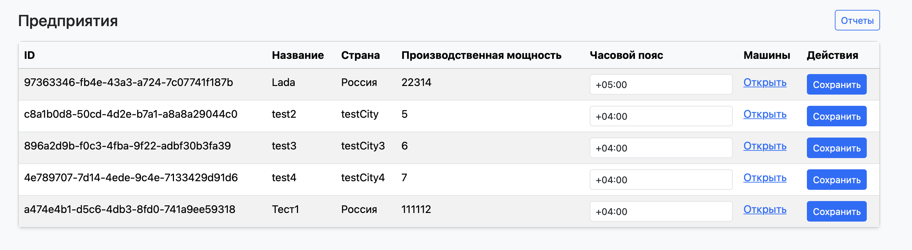
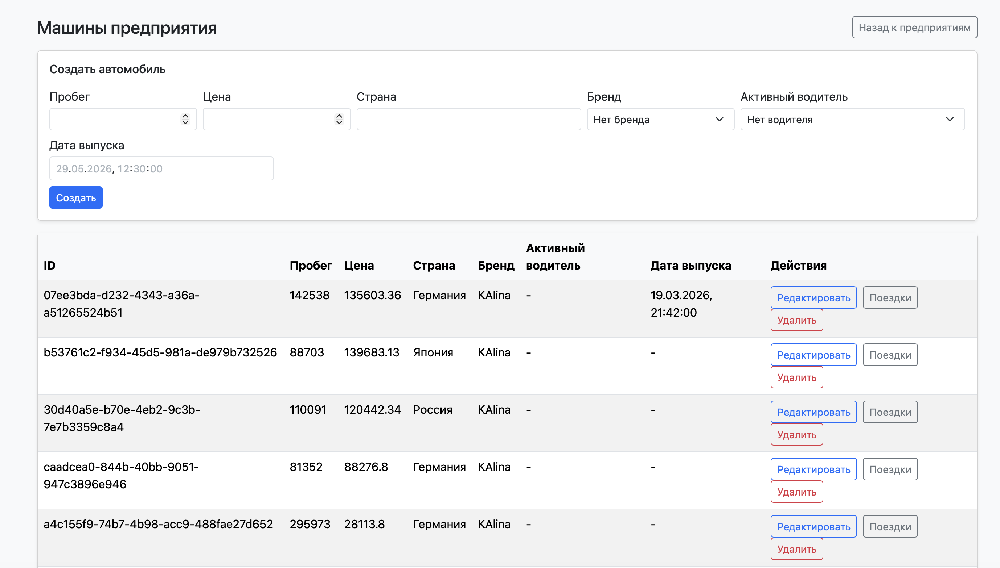
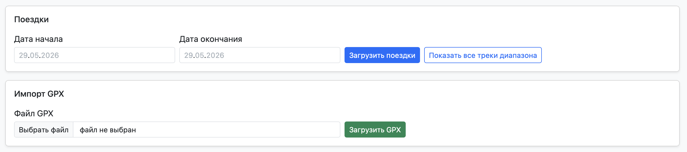
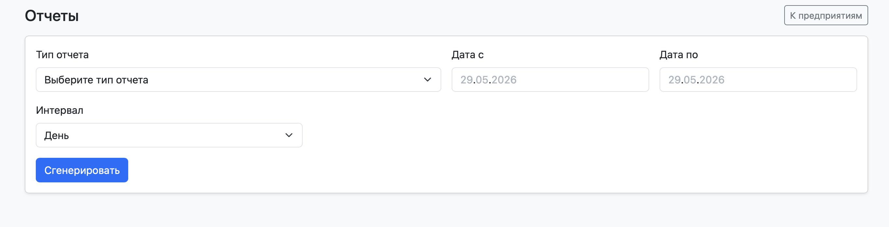

# 🚗 Сервис управления автомобилями и водителями предприятий
Данный проект представляет собой сервис по управлению автомобилями и водителями для нескольких предприятий.

Сервис позволяет пользователям управлять предприятиями через UI и Telegram-бота.

---

## ⚙️ Возможности сервиса и используемые технологии
- 🔐 Аутентификация и авторизация через Jwt токены и Spring security
- 🏢 CRUD-операции для управления автомобилями, водителями и предприятиями
- 🗺️ Возможность отображать GPS-треки автомобилей в поездках за промежуток времени
- 📊 Создание отчетов со Spring Batch в txt, docs, pdf

🛠️ Используемые технологии: Spring Boot 3.4.0, Spring Data Jpa, Spring Webflux, Spring Security,
Postgresql, Docker, Docker-Compose, Gatling, Nginx, Telegram Api, Cypress, Github Actions

---

## 🖥️ Доступные рабочие экраны

1) 🔐 Экран входа
После входа для взаимодействия с сервисом будут использоваться access и refresh токены

2) 🏢 Экран выбора предприятий
На экране показаны доступные для залогиненного пользователя предприятия с возможностью выбора таймзоны.
Все показанные даты и время на UI учитывает часовой пояс пользователя

3) 🚘 Автомобили предприятия с возможностью создания и редактирования

4) 🧭 Выбор и возможность создания поездок с GPS через GPX документы

5) 🗺️ Показ поездок на UI

6) 📊 Возможность выгрузки отчетов

---

### Тестовый запуск
Приложение само создает при запуске таблицы через Hibernate Enity и заполняет их через sql-dump
Тестовый пользователь для работы: manager1 12345

Точка входа http://localhost:8080
Запуск через docker-compose или скрипт deploy.sh

Дополнительно

📊 Grafana: http://localhost:3000 (логин/пароль: admin/admin)

🔍 Prometheus: http://localhost:9090

🚨 Alertmanager: http://localhost:9093

⚙️ Swagger UI: http://localhost/api/swagger-ui.html

Для взаимодействия с Telegram не забудьте указать свой токен)
